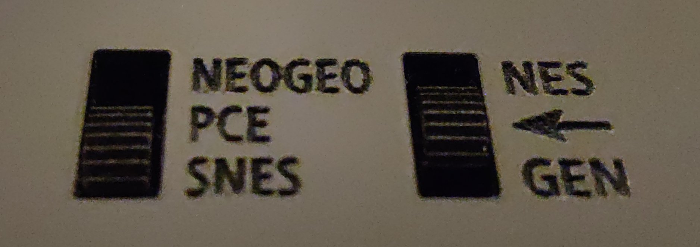
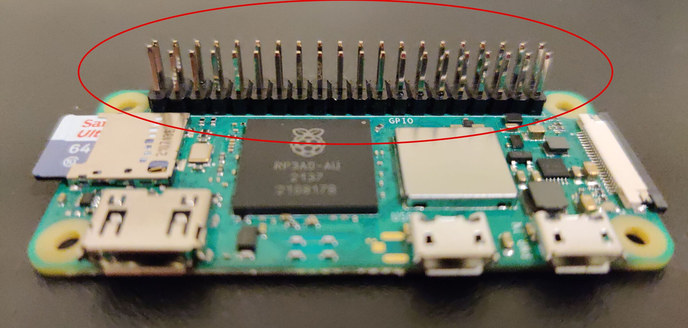
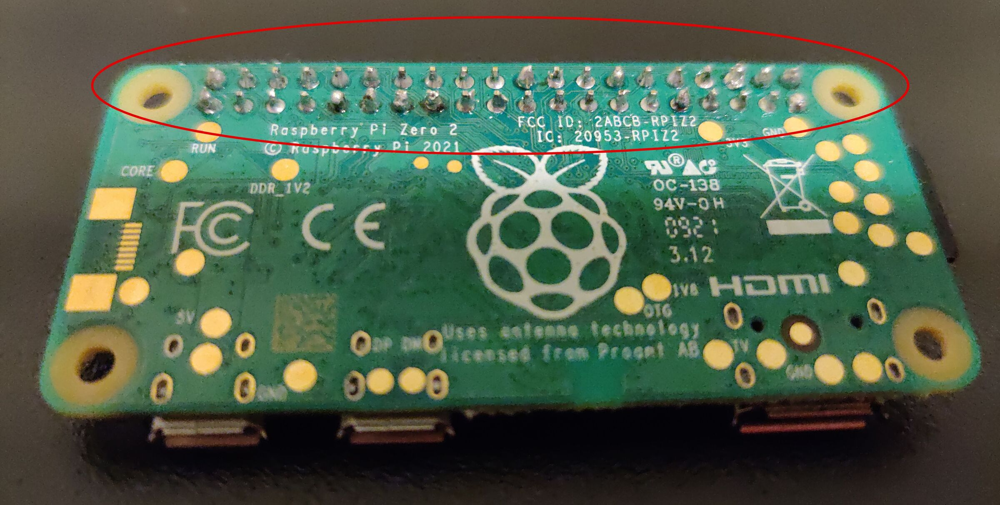
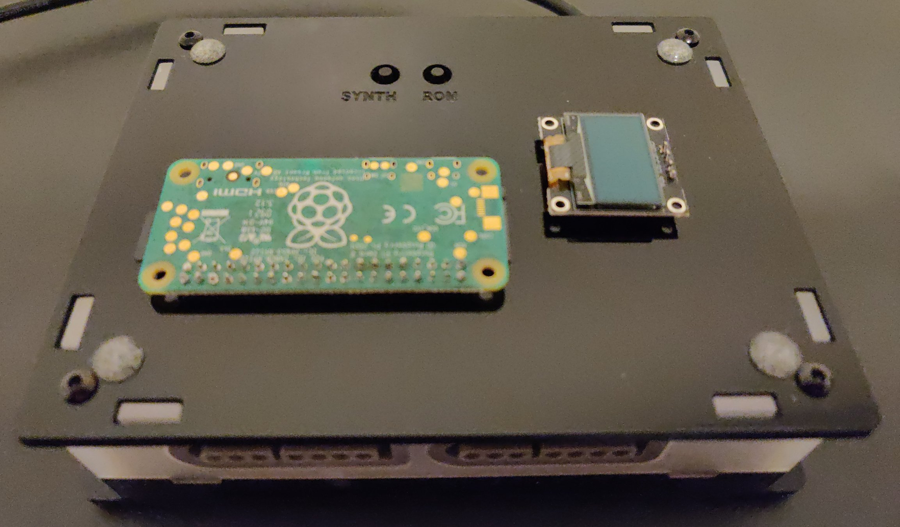
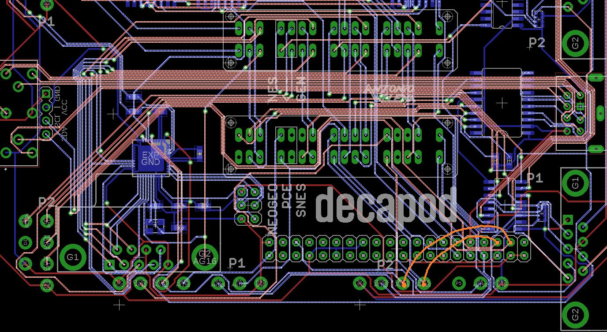

# Decapod

## Table of Contents

* [Products](#products)
* [Input Switches](#input-switches)
* [Decapod for MiSTer-DB9-MT32](#decapod-for-mister-db9-mt32)
* [Firmware Updates](#firmware-updates)

## Products

* [Decapod USB](https://www.antoniovillena.es/store/product/decapod-usb/)
* [Decapod for MiSTer-DB9-MT32](https://www.antoniovillena.es/store/product/decapod/)

## Input Switches

Both Decapod models have 2 switches on top that each have three positions, and between the two there 5 modes:

1. `NES`: Right switch up (**NES**).
2. `Genesis`: Right switch down (**GEN**).
3. `NEOGEO`: Right switch centered (**←**) and left switch up (**NEOGEO**).
4. `PC Engine`/`TurboGrafx`: Right switch centered (**←**) and left switch centered (**PCE**).
5. `SNES` (also `mt32-pi` on the **Decapod for MiSTer-DB9-MT32**): Right switch centered (**←**) and left switch down (**SNES**).

These enable the respective controller ports for use as USB controllers with both the **Decapod USB** and the **Decapod for MiSTer-DB9-MT32** in USB mode.

**Note**: The port between the Genesis/DB9 ports is a Mini-DIN-8 input for a PC Engine controller, and the port between the NES ports is a DIN-8 input for a TurboGrafx controller. Only one of these ports can be used at a time.

## Decapod for MiSTer-DB9-MT32

The **Decapod for MiSTer-DB9-MT32** has a DB9 connector that can be connected to a DB9 user IO port on a compatible MiSTer IO board. This allows mt32-pi support, as well as DB9/DB15 joystick control and one-or-two-controller SNAC8 input in compatible cores.

**Note**: Never connect both the USB and DB9 connectors on the **Decapod for MiSTer-DB9-MT32** at the same time.

### DB9 User IO and SNAC8

To learn how to setup and use this functionality, read the guide on [DB9 User IO and SNAC8](db9-user-io-and-snac8.md).

### mt32-pi

#### Setup

Before you can use the Decapod as an mt32-pi, you need a Raspberry Pi Zero W2 with header pins and a configured SD card.

##### Header Pins

It's possible to purchase a Raspberry Pi Zero W2 with header pins pre-installed, but it's cheaper and relatively easy to solder some on yourself (as seen in [this video](https://www.youtube.com/watch?v=UDdbaMk39tM)).

##### Configured SD Card

Read through the [mt32-pi wiki](https://github.com/dwhinham/mt32-pi/wiki) to learn how to setup an SD card with mt32-pi.

#### Usage

Once you've configured your Raspberry Pi Zero W2, you'll be able to use the Decapod as an mt32-pi by following these steps:

1. Ensure the USB cable is disconnected.
2. Toggle the switches on the Decapod so the `SNES` mode is enabled.
3. Disconnect anything plugged into the SNES controller ports.
4. Orient your Decapod so the side with the `decapod` label is on the bottom, and the SNES ports are on the side closest to you.
5. Orient your Raspberry Pi Zero W2 so its header pins are on the side closest to you and facing down.
6. On the side of the Decapod that's currently facing up, plug the header pins on the Raspberry Pi Zero W2 into the port on the bottom-left.
7. Orient the OLED display so the screen is facing up and its pins are on the right side.
8. On the side of the Decapod that's currently facing up, plug the OLED display into the port on the center-right.
9. Connect the DB9 cable to the DB9 port on your MiSTer IO board.

**NOTE**: The [AO486](https://github.com/MiSTer-devel/ao486_MiSTer) core requires the `USER I/O` option to be set to `MIDI`.

#### Decapod Controls

There are two buttons on the Decapod for controlling mt32pi:

* `SYNTH`: This toggles between using synthesizer engines and sound fonts.
* `ROM`: Depending on which mode you're in, this rotates through each synthesizer engine or sound font.

#### MiSTer OSD

To avoid seeing information on the display that the OLED is already showing, the OSD functionality is disabled by default. This was done by not wiring SCL and SDA on the Raspberry Pi to User IO.

It's possible to enable this functionality by soldering two wires inside the Decapod. The two orange wires on the following diagram show where they need to go from and to.

## Firmware Updates

To update the firmware you need a computer with a USB port and the [Arduino IDE](https://www.arduino.cc/en/software).

1. Clone or download the [DECAPOD-DaemonBite repo](https://github.com/GAsinPrieto/DECAPOD-DaemonBite).
2. Open the `.ino` file for the latest firmware (which as of 2022-02-24 is `DECAPOD-USB-proto2_v1.0/DECAPOD-USB-proto2_v1.0.ino`) in the Arduino IDE.
3. In the Arduino IDE, select `Tools` -> `Board` -> `Arduino Leonardo`
    * If `Arduino Leonardo` isn't available, select `Tools` -> `Board` -> `Boards Manager`, find `Arduino AVR Boards` in the window that appears, press the `Install` button for that entry, and then return to step 3.
4. In the Arduino IDE, select `Tools` -> `Port` and make note of the ports in the list.
5. Connect the provided USB cable from the Decapod to your computer.
6. In the Arduino IDE, select `Tools` -> `Port` again and there should be a new entry in the list, select that.
7. In the Arduino IDE, select `Sketch` -> `Verify/Compile`.
8. In the Arduino IDE, select `Sketch` -> `Upload`.

If everything worked correctly your firmware should now be up to date.
